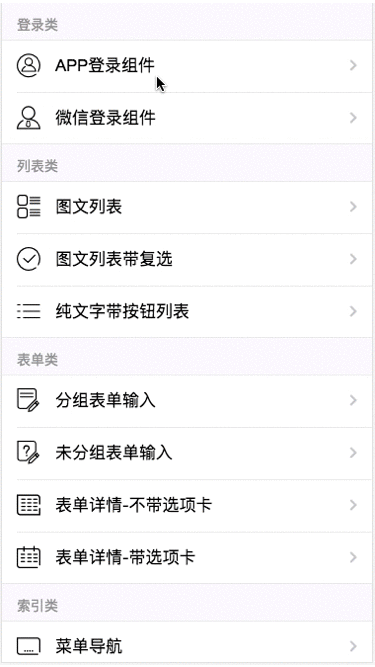
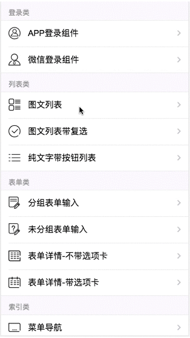
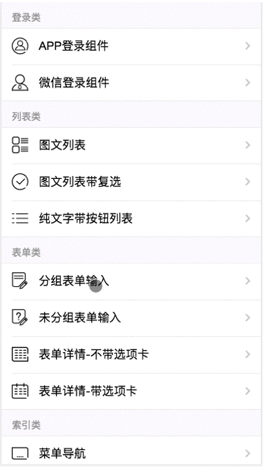

# vue2.x-mysoft-standardui

> 武汉明源专业线-移动项目标准UI

## 演示地址


移动端扫码关注公众号，通过菜单访问典型UI页面。

PC端直接访问 http://zyx.mingyuanyun.com

### 演示效果





## 版本说明
### V1.3 添加本地mock数据访问

> 加入axios-mock-adapter插件，结合axios插件，可在本地模拟访问接口。

### V1.2 优化修改title方式

> 为route添加meta信息，通过读取meta信息来获取各自页面的title。

```js
    {
      path: '/',
      name: 'list',
      component: List,
      meta: {
        title: '组件列表'
      }
    }
```
```js
router.afterEach(route => {
  document.title = route.meta.title
})
```

### V1.1 添加基础组件UI

> 包括登录、列表、表单以及导航类UI

### V1.0 官方脚手架配置

## 构建和安装命令

``` bash
# 安装依赖包
npm install

# 在localhost:8080 运行开发环境
npm run dev

# 在生产环境打包
npm run build
```

